# 📊 Chart Usage Guide - 图表使用指南

## 🎉 新功能：交互式数据可视化

Miaoshou Vision 现在支持使用 **Mosaic vgplot** 创建交互式图表！

### ✨ 支持的图表类型

| 图表类型 | 图标 | 适用场景 |
|----------|------|----------|
| 柱状图 (Bar Chart) | 📊 | 对比分类数据 |
| 折线图 (Line Chart) | 📈 | 显示趋势变化 |
| 散点图 (Scatter) | 🔵 | 探索变量关系 |

---

## 🚀 快速开始

### 完整工作流程

```mermaid
graph LR
    A[上传数据] --> B[执行 SQL 查询]
    B --> C[点击 Create Chart]
    C --> D[配置图表]
    D --> E[生成可视化]
```



### Step 1: 准备数据

```sql
-- 1️⃣ 在 Upload 标签页上传 CSV/Parquet 文件
-- 2️⃣ 切换到 Query 标签页
```

### Step 2: 执行查询

```sql
-- 示例：分组聚合查询
SELECT
  category,
  COUNT(*) as count,
  AVG(price) as avg_price,
  SUM(revenue) as total_revenue
FROM sales_table
GROUP BY category
ORDER BY total_revenue DESC
LIMIT 10;
```

### Step 3: 创建图表

1. 查询执行成功后，点击 **"📊 Create Chart from Result"** 按钮
2. 自动切换到 Visualize 标签页
3. 在左侧配置面板中设置：
   - **Chart Type**: Bar Chart
   - **X Axis**: category
   - **Y Axis**: total_revenue
4. 点击 **"Generate Chart"** 按钮
5. 🎉 享受交互式可视化！

---

## 📋 详细配置选项

### 基础配置

#### Chart Type（图表类型）
- **Bar Chart**: 适合对比分类数据
- **Line Chart**: 适合时间序列或趋势数据
- **Scatter**: 适合探索两个变量的关系

#### Data Source（数据源）
- 自动填充查询结果表名
- 格式：`chart_data_<timestamp>`

#### X Axis（X 轴）
- 选择作为 X 轴的列
- 推荐：分类列、日期列或标签列

#### Y Axis（Y 轴）
- 选择作为 Y 轴的列
- 推荐：数值列（COUNT, SUM, AVG 等）

#### Group By（分组）
- 可选：按类别分组着色
- 用于多系列对比

### 高级配置

#### Dimensions（尺寸）
- **Width**: 300-1200px（默认 680px）
- **Height**: 200-800px（默认 400px）

#### Labels（标签）
- **Chart Title**: 图表标题
- **X Axis Label**: X 轴标签
- **Y Axis Label**: Y 轴标签

---

## 💡 使用示例

### 示例 1: 销售额对比（柱状图）

**查询：**
```sql
SELECT
  region,
  SUM(amount) as total_sales
FROM sales
GROUP BY region
ORDER BY total_sales DESC;
```

**配置：**
- Chart Type: `Bar Chart`
- X Axis: `region`
- Y Axis: `total_sales`
- Title: `Sales by Region`

**效果：** 清晰对比各地区销售额

---

### 示例 2: 趋势分析（折线图）

**查询：**
```sql
SELECT
  DATE_TRUNC('month', order_date) as month,
  SUM(amount) as monthly_sales
FROM orders
WHERE order_date >= '2024-01-01'
GROUP BY month
ORDER BY month;
```

**配置：**
- Chart Type: `Line Chart`
- X Axis: `month`
- Y Axis: `monthly_sales`
- Title: `Monthly Sales Trend`

**效果：** 显示销售额随时间变化

---

### 示例 3: 关系探索（散点图）

**查询：**
```sql
SELECT
  price,
  quantity_sold,
  category
FROM products
WHERE price > 0 AND quantity_sold > 0;
```

**配置：**
- Chart Type: `Scatter`
- X Axis: `price`
- Y Axis: `quantity_sold`
- Group By: `category`

**效果：** 探索价格与销量的关系，按类别着色

---

## 🎨 最佳实践

### 1. 数据准备

✅ **推荐：**
- 使用聚合查询（GROUP BY）
- 限制结果行数（LIMIT）
- 确保数值列类型正确

❌ **避免：**
- 原始数据过大（建议 < 10000 行）
- 包含 NULL 值过多
- 列名包含特殊字符

### 2. 图表选择

| 数据特征 | 推荐图表 |
|----------|----------|
| 分类对比 | Bar Chart |
| 时间序列 | Line Chart |
| 相关性分析 | Scatter |
| 单一数值 | Bar Chart |

### 3. 性能优化

- **数据采样**: 大数据集使用 `LIMIT` 或 `SAMPLE`
- **预聚合**: 在 SQL 中完成聚合计算
- **合理尺寸**: 图表尺寸不要过大

---

## 🔧 故障排除

### 问题 1: 图表无法生成

**可能原因：**
- 没有执行查询
- 查询结果为空
- 列选择错误

**解决方案：**
```sql
-- 1. 确保查询返回数据
SELECT * FROM your_table LIMIT 1;

-- 2. 检查列名是否正确
SELECT column_name FROM INFORMATION_SCHEMA.COLUMNS
WHERE table_name = 'your_table';
```

### 问题 2: 图表显示异常

**可能原因：**
- X/Y 轴数据类型不匹配
- 数据包含 NULL 值
- 数值范围过大/过小

**解决方案：**
```sql
-- 过滤 NULL 值
SELECT x, y FROM table WHERE x IS NOT NULL AND y IS NOT NULL;

-- 数值转换
SELECT CAST(x AS DOUBLE) as x, y FROM table;
```

### 问题 3: 性能慢

**解决方案：**
```sql
-- 使用采样
SELECT * FROM large_table USING SAMPLE 10%;

-- 限制行数
SELECT * FROM large_table LIMIT 1000;

-- 预聚合
SELECT category, AVG(value) as avg_val
FROM large_table
GROUP BY category;
```

---

## 🎓 高级技巧

### 1. 动态分组

```sql
-- 按时间粒度动态分组
SELECT
  DATE_TRUNC('day', timestamp) as date,
  COUNT(*) as count
FROM events
GROUP BY date
ORDER BY date;
```

### 2. 多维度分析

```sql
-- 多列聚合
SELECT
  region,
  product_category,
  SUM(sales) as total_sales
FROM sales_data
GROUP BY region, product_category;
```

### 3. 计算字段

```sql
-- 在查询中创建计算列
SELECT
  month,
  revenue,
  cost,
  (revenue - cost) as profit,
  ROUND((revenue - cost) / revenue * 100, 2) as profit_margin
FROM monthly_data;
```

---

## 📚 示例数据集

### 测试数据

```sql
-- 创建示例数据
CREATE TABLE sales_sample AS
SELECT
  ['North', 'South', 'East', 'West'][1 + (random() * 4)::int] as region,
  ['Product A', 'Product B', 'Product C'][1 + (random() * 3)::int] as product,
  (random() * 1000)::int as amount,
  CURRENT_DATE - (random() * 365)::int as sale_date
FROM generate_series(1, 100);

-- 查询并可视化
SELECT
  region,
  SUM(amount) as total_sales
FROM sales_sample
GROUP BY region
ORDER BY total_sales DESC;
```

---

## 🌟 下一步

### 即将支持

- [ ] 更多图表类型（面积图、饼图等）
- [ ] 图表导出（PNG, SVG）
- [ ] 图表模板
- [ ] 多图表仪表板
- [ ] 图表联动交互

### 反馈

遇到问题或有建议？欢迎提交 Issue！

---

**Happy Charting! 📊✨**
