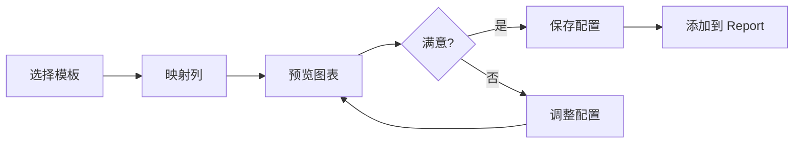

# 可视化能力补齐 - 产品方案

**评估日期**: 2024-12-24
**视角**: 产品经理
**目标**: 补齐 SQL Workspace 与竞品的可视化差距

---

## 📊 现状分析

### 当前 SQL Workspace 可视化能力

**支持的图表类型** (5种):
- ✅ Bar Chart (柱状图)
- ✅ Line Chart (折线图)
- ✅ Pie Chart (饼图)
- ✅ Scatter Plot (散点图)
- ✅ Histogram (直方图)

**配置功能**:
- ✅ X/Y 轴选择
- ✅ 聚合函数 (Sum/Avg/Count/Min/Max)
- ✅ 数据限制 (Top N)
- ✅ 排序
- ❌ 无保存图表配置
- ❌ 无导出图表
- ❌ 无分享功能

---

### 系统已有但未集成的图表 (14种)

**统计分析类**:
1. ✅ **Boxplot** (箱线图) - 分布分析
2. ✅ **Heatmap** (热力图) - 相关性分析
3. ✅ **Radar** (雷达图) - 多维对比
4. ✅ **CalendarHeatmap** (日历热力图) - 时间序列

**流程/关系类**:
5. ✅ **Sankey** (桑基图) - 流向分析
6. ✅ **Funnel** (漏斗图) - 转化分析
7. ✅ **Waterfall** (瀑布图) - 增减分解

**特殊用途类**:
8. ✅ **BubbleChart** (气泡图) - 三维数据
9. ✅ **Treemap** (树图) - 层级占比
10. ✅ **Gauge** (仪表盘) - 指标进度
11. ✅ **BulletChart** (子弹图) - 目标对比

**地理类**:
12. ✅ **AreaMap** (区域地图)
13. ✅ **PointMap** (点地图)
14. ✅ **BubbleMap** (气泡地图)

**辅助类**:
- ✅ **Sparkline** (迷你图)
- ✅ **BigValue/Delta/Value** (KPI 卡片)

---

### 竞品对比

| 功能 | Miaoshou (当前) | Metabase | Redash | Mode | Tableau |
|------|-----------------|----------|--------|------|---------|
| 基础图表 (5-7种) | ✅ 5种 | ✅ 7种 | ✅ 6种 | ✅ 10种 | ✅ 30+种 |
| 高级图表 | ❌ 0种 | ⚠️ 3种 | ⚠️ 2种 | ✅ 8种 | ✅ 20+种 |
| 地图 | ❌ | ⚠️ 基础 | ⚠️ 基础 | ✅ 完整 | ✅ 完整 |
| 图表保存 | ❌ | ✅ | ✅ | ✅ | ✅ |
| 图表导出 | ❌ | ✅ PNG | ✅ PNG | ✅ PNG/SVG | ✅ 多格式 |
| 交互性 | ⚠️ 基础 | ✅ | ✅ | ✅ | ✅ |
| 自定义主题 | ❌ | ✅ | ⚠️ | ✅ | ✅ |
| 图表模板 | ❌ | ✅ | ⚠️ | ✅ | ✅ |

**差距**:
- 🔴 **Critical**: 图表保存、导出
- 🟡 **Important**: 图表类型不足 (5 vs 10-30)
- 🟢 **Nice**: 交互性、主题、模板

---

## 🎯 产品目标

### 短期目标 (1-2月)
- 达到 Metabase/Redash 水平 (10-12种图表)
- 实现图表保存和导出
- 提升图表配置体验

### 中期目标 (3-6月)
- 达到 Mode 水平 (15-20种图表)
- 实现高级交互功能
- 图表模板库

### 长期目标 (6月+)
- 接近 Tableau 水平 (自定义图表、复杂可视化)
- AI 辅助图表推荐
- 实时协作

---

## 💡 方案设计

## 方案 A: 渐进式集成 (推荐)

### 核心理念
**"先快速补齐核心图表，后优化体验"**

分3个阶段逐步集成现有图表组件到 SQL Workspace，同时优化基础设施。

---

### Phase 1: 核心图表集成 (Week 1-2)

**目标**: 补齐最常用的 5 种图表，达到 10 种

**优先图表** (按使用频率):
1. **Area Chart** (面积图) - 线图的增强版
   - 用途: 展示趋势和累计
   - 工作量: 2-3h (基于 Line Chart 改造)
   - 价值: 高 - 时间序列常用

2. **Heatmap** (热力图) ⭐
   - 用途: 相关性矩阵、时间热力
   - 工作量: 4-5h (适配 SQL 结果)
   - 价值: 高 - 数据分析必备
   - 示例: `SELECT hour, day_of_week, COUNT(*) GROUP BY hour, day_of_week`

3. **Boxplot** (箱线图) ⭐
   - 用途: 分布分析、异常检测
   - 工作量: 3-4h
   - 价值: 高 - 统计分析必备
   - 示例: `SELECT category, value FROM data`

4. **BubbleChart** (气泡图)
   - 用途: 三维数据展示 (X, Y, Size)
   - 工作量: 3-4h (组件已完成)
   - 价值: 中 - 多维分析
   - 示例: `SELECT country, gdp, population, life_expectancy`

5. **Funnel** (漏斗图)
   - 用途: 转化分析、流程监控
   - 工作量: 3-4h
   - 价值: 中 - 业务分析常用
   - 示例: `SELECT stage, count FROM user_journey`

**技术实现**:
```typescript
// 扩展 ResultsChartConfig
interface ResultsChartConfig {
  type: 'bar' | 'line' | 'pie' | 'scatter' | 'histogram'
       | 'area' | 'heatmap' | 'boxplot' | 'bubble' | 'funnel' // 新增
  // ...
}

// 组件适配层
import { Heatmap } from '@plugins/data-display/heatmap'
import { transformQueryResultToHeatmapData } from './adapters/heatmap'

function renderHeatmap(result: QueryResult, config: ChartConfig) {
  const heatmapData = transformQueryResultToHeatmapData(result, config)
  return <Heatmap data={heatmapData} />
}
```

**配置界面优化**:
- [ ] 图表类型分组 (Basic / Statistical / Business / Geographic)
- [ ] 智能推荐图表类型 (基于数据特征)
- [ ] 配置预设模板

**总工作量**: 15-20 hours
**价值**: ⭐⭐⭐⭐⭐ 快速补齐核心能力

---

### Phase 2: 保存与导出 (Week 2-3)

**目标**: 实现图表保存、导出、复用

**功能清单**:

1. **图表配置保存**
   - [ ] 保存图表配置到本地 (localStorage)
   - [ ] 命名和分类
   - [ ] 快速加载已保存的图表
   - [ ] 导出/导入图表配置 (JSON)
   - 工作量: 4-5h

2. **图表导出**
   - [ ] 导出为 PNG (使用 html2canvas)
   - [ ] 导出为 SVG (原生支持)
   - [ ] 导出数据 (CSV/Excel)
   - [ ] 复制图表到剪贴板
   - 工作量: 5-6h

3. **一键添加到 Report**
   - [ ] "Add to Report" 按钮
   - [ ] 自动生成 Markdown 代码块
   - [ ] 保存查询和图表配置
   - 工作量: 3-4h

**UI 设计**:
```
┌─────────────────────────────────────┐
│ 📊 Chart View                   [...] │
├─────────────────────────────────────┤
│ [Chart Preview]                      │
│                                      │
│ [Heatmap showing correlation...]     │
│                                      │
├─────────────────────────────────────┤
│ 💾 Save   📤 Export   ➕ Add to Report│
└─────────────────────────────────────┘
```

**总工作量**: 12-15 hours
**价值**: ⭐⭐⭐⭐⭐ 核心工作流完整

---

### Phase 3: 高级图表 (Week 4-5)

**目标**: 补充专业分析图表，达到 15-18 种

**优先图表**:

6. **Waterfall** (瀑布图)
   - 用途: 财务分析、增减分解
   - 工作量: 4-5h
   - 价值: 中 - 商业分析

7. **Radar** (雷达图)
   - 用途: 多维评估、竞品对比
   - 工作量: 3-4h
   - 价值: 中 - 评估对比

8. **Sankey** (桑基图)
   - 用途: 流向分析、能量流
   - 工作量: 5-6h
   - 价值: 中 - 流程分析

9. **Treemap** (树图)
   - 用途: 层级占比、磁盘空间
   - 工作量: 3-4h
   - 价值: 中 - 层级数据

10. **Gauge** (仪表盘)
    - 用途: KPI 监控、进度展示
    - 工作量: 2-3h
    - 价值: 中 - 指标展示

**总工作量**: 17-22 hours
**价值**: ⭐⭐⭐ 专业能力提升

---

### 方案 A 总结

| 阶段 | 工作量 | 图表数量 | 时间 |
|------|--------|----------|------|
| Phase 1 | 15-20h | 5→10 | Week 1-2 |
| Phase 2 | 12-15h | 保存/导出 | Week 2-3 |
| Phase 3 | 17-22h | 10→15 | Week 4-5 |
| **总计** | **44-57h** | **15种** | **5周** |

**优势**:
- ✅ 复用现有组件，开发快速
- ✅ 渐进式交付，每阶段都有价值
- ✅ 风险低，技术路径清晰

**劣势**:
- ⚠️ 需要编写大量适配代码
- ⚠️ 配置界面复杂度提升

---

## 方案 B: 图表推荐引擎 (创新)

### 核心理念
**"AI 自动推荐最佳图表，降低用户选择成本"**

用户不需要手动选择图表类型，系统根据数据特征自动推荐。

---

### 设计思路

**1. 数据特征分析**
```typescript
interface DataCharacteristics {
  rowCount: number              // 数据量
  columnCount: number           // 列数
  numericColumns: number        // 数值列数量
  categoricalColumns: number    // 分类列数量
  dateColumns: number           // 时间列数量
  hasHierarchy: boolean         // 是否有层级关系
  hasGeo: boolean               // 是否有地理信息
  hasDuplicates: boolean        // X 轴是否有重复值
  cardinality: Record<string, number> // 每列的基数
}
```

**2. 推荐规则引擎**
```typescript
function recommendCharts(characteristics: DataCharacteristics): ChartRecommendation[] {
  const recommendations: ChartRecommendation[] = []

  // 规则 1: 时间序列 → Line/Area
  if (characteristics.dateColumns > 0 && characteristics.numericColumns > 0) {
    recommendations.push({
      type: 'line',
      confidence: 0.9,
      reason: 'Time series data detected'
    })
  }

  // 规则 2: 1 分类列 + 1 数值列 → Bar
  if (characteristics.categoricalColumns === 1 && characteristics.numericColumns === 1) {
    recommendations.push({
      type: 'bar',
      confidence: 0.85,
      reason: 'Category vs numeric comparison'
    })
  }

  // 规则 3: 2 数值列 → Scatter
  if (characteristics.numericColumns >= 2 && characteristics.categoricalColumns === 0) {
    recommendations.push({
      type: 'scatter',
      confidence: 0.8,
      reason: 'Numeric correlation analysis'
    })
  }

  // 规则 4: 3 数值列 → Bubble
  if (characteristics.numericColumns >= 3) {
    recommendations.push({
      type: 'bubble',
      confidence: 0.75,
      reason: 'Multi-dimensional numeric data'
    })
  }

  // 规则 5: 矩阵数据 (hour x day) → Heatmap
  if (characteristics.categoricalColumns === 2 && characteristics.numericColumns === 1) {
    const cardinalityProduct = Object.values(characteristics.cardinality).reduce((a, b) => a * b, 1)
    if (cardinalityProduct < 500) { // 不要太大
      recommendations.push({
        type: 'heatmap',
        confidence: 0.7,
        reason: 'Matrix data pattern detected'
      })
    }
  }

  // 规则 6: 分布分析 → Histogram/Boxplot
  if (characteristics.numericColumns === 1 && characteristics.rowCount > 20) {
    recommendations.push({
      type: 'histogram',
      confidence: 0.65,
      reason: 'Distribution analysis'
    })
  }

  // 规则 7: 流程数据 (stage → count) → Funnel
  if (characteristics.categoricalColumns === 1
      && characteristics.numericColumns === 1
      && characteristics.rowCount <= 10) {
    recommendations.push({
      type: 'funnel',
      confidence: 0.6,
      reason: 'Process flow pattern'
    })
  }

  return recommendations.sort((a, b) => b.confidence - a.confidence)
}
```

**3. UI 设计**
```
┌──────────────────────────────────────────┐
│ 📊 Recommended Visualizations            │
├──────────────────────────────────────────┤
│ ⭐ Line Chart (90% match)                │
│    "Time series data detected"           │
│    [Preview] [Use This]                  │
├──────────────────────────────────────────┤
│ 📊 Bar Chart (85% match)                 │
│    "Category comparison"                 │
│    [Preview] [Use This]                  │
├──────────────────────────────────────────┤
│ 📍 More options (8 charts available)     │
│    [Show All Charts]                     │
└──────────────────────────────────────────┘
```

**4. 实现步骤**
- [ ] Week 1: 实现数据特征分析引擎
- [ ] Week 2: 实现推荐规则引擎
- [ ] Week 3: UI 设计和集成
- [ ] Week 4: A/B 测试和优化

**总工作量**: 20-25 hours
**价值**: ⭐⭐⭐⭐⭐ 差异化竞争力

**优势**:
- ✅ 降低用户学习成本
- ✅ 提升选择效率
- ✅ 差异化功能 (竞品少有)

**劣势**:
- ⚠️ 推荐准确性需要调优
- ⚠️ 仍需要基础图表集成

**建议**: 与方案 A 结合，Phase 1 后实施

---

## 方案 C: 图表市场 (生态)

### 核心理念
**"开放图表插件系统，支持社区贡献"**

类似 VS Code Extensions，用户可以安装和分享自定义图表。

---

### 架构设计

**1. 图表插件规范**
```typescript
// chart-plugin.d.ts
interface ChartPlugin {
  metadata: {
    id: string
    name: string
    version: string
    author: string
    description: string
    icon: string
    category: 'basic' | 'statistical' | 'business' | 'geographic' | 'custom'
    tags: string[]
  }

  // 数据要求
  requirements: {
    minColumns: number
    maxColumns: number
    columnTypes: {
      [key: string]: 'number' | 'string' | 'date' | 'any'
    }
  }

  // 配置 Schema
  configSchema: JSONSchema

  // 渲染函数
  render: (data: QueryResult, config: any) => SvelteComponent

  // 示例查询
  exampleQueries: string[]
}
```

**2. 插件市场界面**
```
┌──────────────────────────────────────────┐
│ 🎨 Chart Marketplace                     │
├──────────────────────────────────────────┤
│ 🔍 Search: [____________________] [🔍]   │
│                                          │
│ 📊 Popular Charts                        │
│ ┌────────┐ ┌────────┐ ┌────────┐        │
│ │Violin  │ │Network │ │Candl..│        │
│ │Plot    │ │Graph   │ │stick  │        │
│ │⭐ 245  │ │⭐ 189  │ │⭐ 156 │        │
│ └────────┘ └────────┘ └────────┘        │
│                                          │
│ 🆕 Recently Added                        │
│ • 3D Scatter Plot (by @user1)            │
│ • Sunburst Chart (by @user2)             │
└──────────────────────────────────────────┘
```

**3. 内置图表 Gallery**
```
┌──────────────────────────────────────────┐
│ 📚 Installed Charts (18)                 │
├──────────────────────────────────────────┤
│ Basic (5)                                │
│ • Bar Chart                              │
│ • Line Chart                             │
│ • Pie Chart                              │
│ • Scatter Plot                           │
│ • Histogram                              │
│                                          │
│ Statistical (4)                          │
│ • Boxplot                                │
│ • Heatmap                                │
│ • Violin Plot (🆕 Plugin)                │
│ • Correlation Matrix (🆕 Plugin)         │
│                                          │
│ Business (3)                             │
│ • Funnel Chart                           │
│ • Waterfall Chart                        │
│ • Bullet Chart                           │
│                                          │
│ [+ Install from Marketplace]             │
└──────────────────────────────────────────┘
```

**4. 实现路线**
- [ ] Month 1: 设计插件规范和 API
- [ ] Month 2: 实现插件加载器和沙箱
- [ ] Month 3: 开发插件市场 (前端 + 后端)
- [ ] Month 4: 社区推广和首批插件

**总工作量**: 80-100 hours (2-3个月)
**价值**: ⭐⭐⭐⭐ 长期生态价值

**优势**:
- ✅ 无限扩展性
- ✅ 社区贡献降低维护成本
- ✅ 产品差异化

**劣势**:
- ⚠️ 开发周期长
- ⚠️ 需要社区运营
- ⚠️ 安全性和质量控制

**建议**: 长期战略，暂不优先

---

## 方案 D: 图表模板库 (快速)

### 核心理念
**"预设常用图表配置，一键生成可视化"**

类似 Canva 的模板系统，用户选择模板后自动填充数据。

---

### 模板示例

**1. 业务分析模板**

```yaml
# 模板 1: Sales Dashboard
name: "Monthly Sales Trend"
description: "Visualize sales performance over time"
chart_type: "line"
required_columns:
  - name: "date_column"
    type: "date"
    label: "Select date column"
  - name: "sales_column"
    type: "number"
    label: "Select sales/revenue column"
optional_columns:
  - name: "category_column"
    type: "string"
    label: "Group by category (optional)"
suggested_query: |
  SELECT
    DATE_TRUNC('month', order_date) as month,
    SUM(total_amount) as sales
  FROM orders
  GROUP BY month
  ORDER BY month
preview_image: "/templates/sales-trend.png"
```

```yaml
# 模板 2: Conversion Funnel
name: "Conversion Funnel Analysis"
description: "Track user journey through stages"
chart_type: "funnel"
required_columns:
  - name: "stage_column"
    type: "string"
    label: "Funnel stage"
  - name: "count_column"
    type: "number"
    label: "User count"
suggested_query: |
  SELECT
    stage,
    COUNT(DISTINCT user_id) as users
  FROM user_events
  WHERE event_date >= '2024-01-01'
  GROUP BY stage
  ORDER BY CASE stage
    WHEN 'Visit' THEN 1
    WHEN 'Signup' THEN 2
    WHEN 'Trial' THEN 3
    WHEN 'Purchase' THEN 4
  END
```

**2. 数据分析模板**

```yaml
# 模板 3: Distribution Analysis
name: "Value Distribution (Boxplot)"
description: "Analyze data distribution and outliers"
chart_type: "boxplot"
required_columns:
  - name: "category_column"
    type: "string"
    label: "Category to compare"
  - name: "value_column"
    type: "number"
    label: "Value to analyze"
suggested_query: |
  SELECT
    category,
    value
  FROM dataset
  WHERE value IS NOT NULL
```

**3. 时间分析模板**

```yaml
# 模板 4: Hourly Activity Heatmap
name: "Activity Heatmap (Hour x Day)"
description: "See when users are most active"
chart_type: "heatmap"
required_columns:
  - name: "hour"
    type: "number"
    label: "Hour of day (0-23)"
  - name: "day"
    type: "string"
    label: "Day of week"
  - name: "activity"
    type: "number"
    label: "Activity count"
suggested_query: |
  SELECT
    EXTRACT(HOUR FROM created_at) as hour,
    DAYNAME(created_at) as day,
    COUNT(*) as activity
  FROM events
  GROUP BY hour, day
```

**4. UI 设计**

```
┌──────────────────────────────────────────┐
│ 📑 Chart Templates                       │
├──────────────────────────────────────────┤
│ 🔍 [Search templates...]                 │
│                                          │
│ 💼 Business Analytics (8 templates)      │
│ ┌─────────────────────────────────┐     │
│ │ 📊 Monthly Sales Trend          │     │
│ │ [Preview]                       │     │
│ │ "Track revenue over time"       │     │
│ │ [Use Template]                  │     │
│ └─────────────────────────────────┘     │
│                                          │
│ 📈 Data Science (6 templates)            │
│ • Distribution Analysis (Boxplot)        │
│ • Correlation Matrix (Heatmap)           │
│ • Outlier Detection (Scatter + Stats)    │
│                                          │
│ ⏰ Time Series (5 templates)             │
│ • Hourly Activity Heatmap                │
│ • Seasonal Patterns                      │
│ • YoY Growth Comparison                  │
└──────────────────────────────────────────┘
```

**5. 工作流**



**6. 实现步骤**
- [ ] Week 1: 设计模板数据结构和加载器
- [ ] Week 2: 实现列映射 UI
- [ ] Week 3: 创建 20+ 常用模板
- [ ] Week 4: 集成到 SQL Workspace

**总工作量**: 15-20 hours
**价值**: ⭐⭐⭐⭐ 用户体验提升

**优势**:
- ✅ 降低学习成本
- ✅ 最佳实践传播
- ✅ 快速生成专业图表

**劣势**:
- ⚠️ 需要维护模板库
- ⚠️ 灵活性有限

**建议**: 与方案 A 结合，Phase 2 后实施

---

## 📊 方案对比

| 维度 | 方案 A<br>渐进集成 | 方案 B<br>推荐引擎 | 方案 C<br>图表市场 | 方案 D<br>模板库 |
|------|-------------------|-------------------|-------------------|-----------------|
| **开发周期** | 5周 | 4周 | 3个月 | 4周 |
| **工作量** | 44-57h | 20-25h | 80-100h | 15-20h |
| **图表数量** | +10种 | 依赖 A | 无限 | +0 (复用) |
| **学习成本** | 中 | 低⭐ | 中 | 低⭐ |
| **差异化** | ⚠️ | ✅⭐ | ✅⭐ | ⚠️ |
| **维护成本** | 中 | 低 | 高 | 中 |
| **用户价值** | ⭐⭐⭐⭐ | ⭐⭐⭐⭐⭐ | ⭐⭐⭐ | ⭐⭐⭐⭐ |
| **技术风险** | 低✅ | 中 | 高 | 低✅ |
| **立即可行** | ✅ | ✅ | ❌ | ✅ |

---

## 🎯 推荐方案

### 组合方案: A + B + D (分阶段)

**理由**:
1. **方案 A** 是基础，必须先补齐图表类型
2. **方案 B** 是差异化功能，提升用户体验
3. **方案 D** 是加速器，降低学习成本
4. **方案 C** 是长期战略，暂不优先

**实施路线**:

```
Month 1 (Week 1-4): 方案 A - Phase 1 & 2
├─ Week 1-2: 集成 5 种核心图表 (Heatmap, Boxplot, Bubble, Funnel, Area)
└─ Week 3-4: 实现图表保存和导出

Month 2 (Week 5-8): 方案 B + 方案 D
├─ Week 5-6: 实现图表推荐引擎
└─ Week 7-8: 创建图表模板库 (20+ 模板)

Month 3 (Week 9-12): 方案 A - Phase 3 + 优化
├─ Week 9-10: 集成 5 种高级图表 (Waterfall, Radar, Sankey, Treemap, Gauge)
├─ Week 11: 图表交互增强 (tooltip, zoom, filter)
└─ Week 12: 性能优化和用户测试

Future (Month 4+): 方案 C (可选)
└─ 如果产品 PMF 验证成功，考虑启动图表市场
```

**总工作量**: 79-102 hours (约 10-13 周 @ 8h/周)

**预期成果**:
- ✅ 图表类型: 5 → 15+ 种
- ✅ 达到 Metabase/Redash 水平
- ✅ 差异化功能: AI 推荐 + 模板库
- ✅ 完整工作流: 保存、导出、复用

---

## 💡 额外建议

### 1. 图表交互增强 (优先级: 高)
- [ ] Tooltip 优化 (显示详细数据)
- [ ] 点击筛选 (click to filter)
- [ ] 缩放和平移 (zoom & pan)
- [ ] 图例交互 (toggle series)
- [ ] 数据标签开关

### 2. 图表主题系统 (优先级: 中)
- [ ] 预设主题 (默认、深色、高对比)
- [ ] 自定义配色方案
- [ ] 品牌色定制
- [ ] 主题导出/导入

### 3. 图表性能优化 (优先级: 中)
- [ ] 虚拟渲染 (大数据集)
- [ ] Canvas 替代 SVG (>1000 points)
- [ ] 智能采样 (downsampling)
- [ ] Web Worker 数据处理

### 4. 协作功能 (优先级: 低)
- [ ] 图表评论
- [ ] 分享链接 (只读)
- [ ] 嵌入代码 (iframe)
- [ ] 团队图表库

---

## 📈 成功指标

| 指标 | 当前 | 3个月目标 | 测量方法 |
|------|------|----------|----------|
| 图表类型数量 | 5 | 15+ | 功能清单 |
| 图表使用率 | - | 80% 查询 | Analytics |
| 平均配置时间 | - | <2 min | 用户测试 |
| 图表保存率 | 0% | 60% | 使用数据 |
| 用户满意度 | - | 8/10 | NPS |
| 对比竞品差距 | -60% | -20% | 功能对比 |

---

## 🎓 参考资料

### 竞品分析
- [Metabase Chart Types](https://www.metabase.com/docs/latest/questions/query-builder/visualizations)
- [Redash Visualizations](https://redash.io/help/user-guide/visualizations)
- [Mode Chart Reference](https://mode.com/help/articles/chart-types/)

### 技术参考
- [Apache ECharts](https://echarts.apache.org/) - 图表推荐算法参考
- [Observable Plot](https://observablehq.com/plot/) - 图表语法参考
- [Vega-Lite](https://vega.github.io/vega-lite/) - 声明式可视化

### 最佳实践
- [Data Viz Catalogue](https://datavizcatalogue.com/) - 图表选择指南
- [Financial Times Visual Vocabulary](https://github.com/Financial-Times/chart-doctor/tree/main/visual-vocabulary) - 图表类型分类

---

**总结**: 建议采用 **组合方案 (A+B+D)**，分 3 个月实施，重点补齐核心图表类型，同时通过推荐引擎和模板库降低用户学习成本，达到竞品水平并实现差异化。
